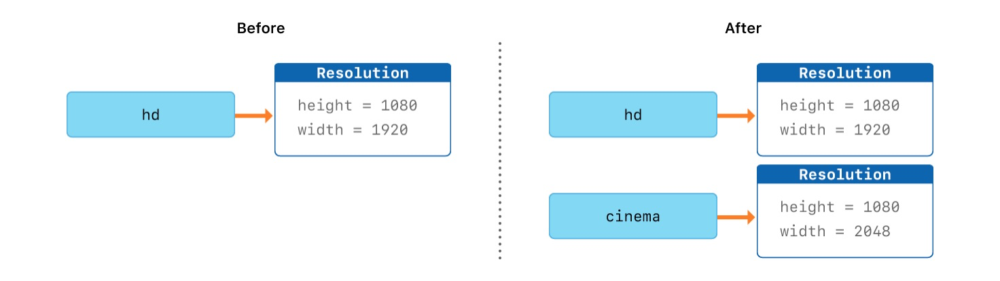

# struct가 무엇이고 어떻게 사용하는지 설명하시오.

이름 그대로 프로그래밍 코드의 건축자재 역할로  클래스와 유사하여 자주 비교된다.

다른 언어와의 차이점 ? 구조체 또는 클래스에 대해 인터페이스와 구현체로 분리하여 생성하는 것이 필수가 아니며 첫 파일 생성시 외부 인터페이스는 자동으로 생성할 수 있다.

구현

```swift
struct Resolution {
  var width = 0
  var height = 0
}
class VideoMode {
  var resolution = Resolution()
  var interlaced = false
  var frameRate = 0.0
  var name: String?
}
/*
let someResolution = Resolution() //구조체명()으로 기본 초기화 가능
let someVideoMode = VideoMode()
someResolution.width //점 접근자를 통해서 내부 속성 접근가능

let vga = Resolution(width: 640, height: 480) 
//멤버 이니셜라이저 자동 지원, 클래스는 자동으로는 미지원

*/
```

구조체 vs 클래스

|  | 클래스 | 구조체 |
| --- | --- | --- |
| 공통 기능 | 속성, 메서드, 서브스크립트, 이니셜라이저, 익스텐션, 프로토콜 채택 |  |
| 고유 기능 | 상속, 타입변환, deinitializer, Reference Counting |  |
| 타입 | 참조타입 | 값타입 |

클래스가 기능이 더 많기 때문에 더 좋다? 

→ 큰 힘에는 큰 책임이 따른다.. 오히려 더 많은 능력으로 인해 복잡도 증가. 

자주 사용되는 사용자 자료 타입은 클래스가 아니다!

→ 참조타입에서 오는 변경 원인 파악 어려움.

```swift
let hd = Resolution(width : 1920, height : 1080)
var cinema = hd
cinema.width = 2048
print(cinema.width) // 2048
print(hd.width) // 1920
```



구조체는 값타입이기 때문에 cinema 변수에 hd를 할당시 저장된 값들을 복사.

```swift
let tenEighty = VideoMode() //let으로 선언했는데 속성 값이 변경 가능하다!
tenEighty.resolution = hd
tenEighty.interlaced = true
tenEighty.name = "1080i"
tenEighty.frameRate = 25.0

let alsoTenEighty = tenEighty
alsoTenEighty.frameRate = 30.0
print(tenEighty.frameRate)//30
print(alsoTenEighty.frameRate)//30
```


클래스는 속성들을 복사한 새로운 인스턴스가 아닌 원본 인스턴스의 주소를 참조만 하고있는 단일 인스턴스이다.

만약 실제 값이 담긴 인스턴스를 참조하고 있는 여러 단일 인스턴스 중 하나라도 속성에 변화를 준다면, 다른 단일 인스턴스에서도 값이 바뀌어 예기치 못한 문제가 발생할수도 있다!

### 구조체를 쓰는 것이 더 권장될 때

- **Obejctive-C와의 상호작용이 있을 때, 클래스의 참조식별 단위인 ID를 컨트롤하는 경우를 제외한 모든 경우**
- *컨트롤하지 않는 id를 가진 엔티티의 정보를 포함한 데이터를 모델링할 때는 구조체를 써도 된다.
    
    원격 데이터베이스를 참조하는 앱에서 인스턴스의 ID는 외부 엔터티가 완전히 소유하고 식별자로 통신할 수 있습니다. 앱 모델의 일관성이 서버에 저장되어 있는 경우 레코드를 식별자가 있는 구조로 모델링할 수 있습니다.
    
    ```swift
    struct PenPalRecord {
        let myID: Int
        var myNickname: String
        var recommendedPenPalID: Int
    }
    
    var myRecord = try JSONDecoder().decode(PenPalRecord.self, from: jsonResponse)
    //
    ```
    
    PenPalRecord와 같은 모델 유형에 대한 로컬 변경이 유용합니다.  앱은 사용자 피드백에 대한 응답으로 여러 펜팔을 추천할 수 있습니다. PenPalRecord 구조는 기본 데이터베이스 레코드의 ID를 제어하지 않기 때문에 로컬 값이 변경되더라도 실제 데이터베이스 레코드의 ID에 문제가 발생하지 않습니다.
    

참고

[애플 공식 문서(****Choosing Between Structures and Classes)****](./참고/appleDocuForStruct.md)
